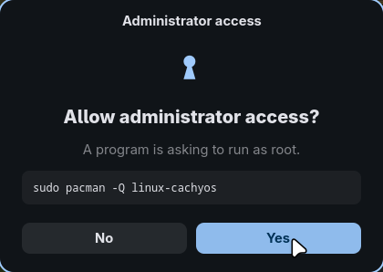
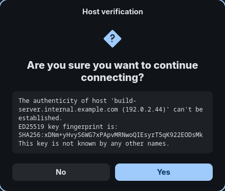
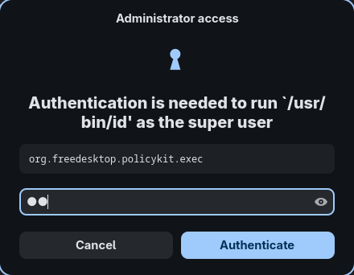
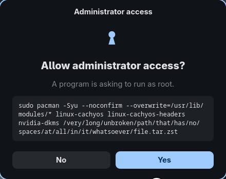

# hypr-uac

A Windows-UAC-style elevation prompt for Hyprland: `sudo` asks you **Yes or No**
instead of asking for your password.

<p align="center">
  
</p>

It is a normal floating window, not a layer-shell overlay, and it is GTK4 +
libadwaita with no colours hardcoded — so it inherits your colour scheme, your
font and your `~/.config/gtk-4.0/gtk.css`, and re-themes itself when you change
them. It shows the actual command being elevated, read from the calling `sudo`
process.

The same window handles ssh, via `SSH_ASKPASS` — passphrases, and host-key
questions as real Yes/No buttons:

<p align="center">
  
</p>

## Read this before installing

**This replaces a password with a click.** Any process that can synthesize
input can approve a prompt — and on Wayland compositors with an IPC socket,
including Hyprland, a process running as you can reach that socket. Windows
draws UAC on a secure desktop specifically to prevent this; there is no
equivalent here.

That is a real reduction in security, not a cosmetic change. It is a reasonable
trade on a single-user desktop where the alternative is typing your password
twenty times a day. It is a bad trade on a machine with untrusted local users,
or where you run untrusted code as your own user.

Your screen lock is untouched, and should stay that way.

## How it works

Two lines above the existing stack in `/etc/pam.d/sudo`:

```
auth [success=done default=ignore] pam_exec.so quiet /usr/local/bin/hypr-uac-pam prompt
auth [success=die  default=ignore] pam_exec.so quiet /usr/local/bin/hypr-uac-pam denied
```

- **Yes** → `done`. The stack ends, no password.
- **No** → the helper records the refusal, the second line turns it into `die`,
  and sudo fails at once instead of falling through to a password prompt.
- **Anything else** — tty, ssh, Hyprland not running, toolkit failure — both
  lines are `ignore`d and your normal password stack runs untouched.

That last point is the safety property: **a broken or missing dialog cannot
lock you out**, because failure means "fall through", not "deny". If you change
this, verify it. The behaviour was confirmed here against an isolated PAM
service with a `pam_authenticate` client, both branches, rather than by reading
the docs and hoping.

## Install

Requires `python-gobject`, `gtk4`, `libadwaita`, and Hyprland ≥ 0.56 for the
example rule syntax.

```sh
git clone https://github.com/<you>/hypr-uac
cd hypr-uac
./install.sh
```

The installer backs up `/etc/pam.d/sudo`, inserts the two lines above the
existing stack without replacing it, and is safe to re-run. Two manual steps
are printed at the end: the window rules, and the askpass exports.

Uninstall with `./uninstall.sh`, which restores the backup first.

Verify:

```sh
sudo -k && sudo id
```

## polkit

GUI apps — disk mounting, network settings, vendor tools — authorize through
polkit, not sudo. `./install.sh --polkit-agent` replaces `hyprpolkitagent`
with an agent that uses the same window, so those prompts stop looking like
they came from a different machine, and say what they are authorizing:

<p align="center">
  
</p>

**It is still a password**, deliberately. The consent prompt cannot be moved
to polkit: `polkit-agent-helper@.service`, which runs the PAM stack, is
sandboxed with `ProtectHome=yes` — that hides `/home` **and `/run/user`** — so
it cannot reach your session to draw anything, by spawning a dialog or by
handing off to a session daemon over a socket. `polkitd` itself runs as its
own unprivileged user with the same hardening, so the `polkit.spawn()` hatch
in a JS rule is closed too. Making it work means weakening the sandbox on the
component that performs authentication, which is not a trade this project
recommends.

The agent is the one part of polkit's flow that *is* in your session, and it
is also the only place that knows the action id and message, which PAM never
receives. That is why it is an agent and not a PAM module.

Two implementation notes, because both cost real time to find:

- Subclassing `PolkitAgent.Listener` from Python **does not work**. Its async
  vfunc hands you a `user_data` gpointer that PyGI cannot marshal, so it
  arrives as `None`; passing that back through `Gio.Task` makes
  libpolkit-agent invoke its callback with `NULL` and segfault. The symptom is
  misleading — the session reports `gained_authorization=True`, the agent
  dies, and polkitd logs `FAILED to authenticate`. This agent talks to polkitd
  over D-Bus directly and uses `PolkitAgent.Session`, which is a plain GObject
  and fine.
- The unit deliberately has no `ConditionEnvironment=WAYLAND_DISPLAY`. A unit
  skipped on an unmet condition stays dead for the whole login instead of
  retrying, which is exactly how `hyprpolkitagent` ends up silently absent if
  it starts before the compositor exports its variables. The agent finds the
  Wayland socket itself.

If you want polkit actions to stop prompting entirely, that is an
authorization-policy question, not a UI one: `examples/polkit/` has a rule
making chosen **bounded** actions passwordless for a local, active session,
while anything granting general-purpose root keeps its password. Read the
comments — it is promptless, a different trade from the rest of this project.

## What it does not cover

**Your screen lock**, deliberately. **`su`**, untouched.

## Things worth knowing

- `sudo -n` never enters PAM, so scripts probing for sudo still fail instantly
  instead of popping a dialog at you.
- sudo retries auth three times after a failure. The refusal is remembered for
  the whole invocation, so "No" is answered once, not three times.
- sudo's timestamp is per-tty. Tools that run commands without a tty get a
  fresh prompt every time; `Defaults timestamp_type=global` in sudoers changes
  that, at the cost of sharing one timestamp across all your terminals.
- An unanswered prompt is refused after 60s. `HYPR_UAC_TIMEOUT` overrides it,
  and can only ever deny sooner, never allow.
- Long commands wrap inside the window rather than stretching it:

<p align="center">
  
</p>

## Exit codes

`hypr-uac` distinguishes three outcomes, and the PAM helper depends on telling
them apart:

| Code | Meaning |
|------|---------|
| `0` | Allowed, or an answer was produced |
| `1` | Refused by the user |
| `2` | Could not ask — no display, toolkit failure. Callers should fall back. |

## Licence

MIT. See [LICENSE](LICENSE).
